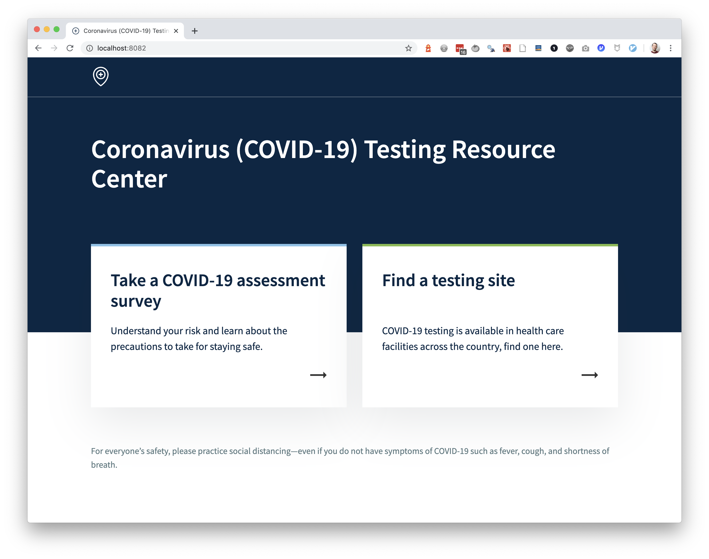
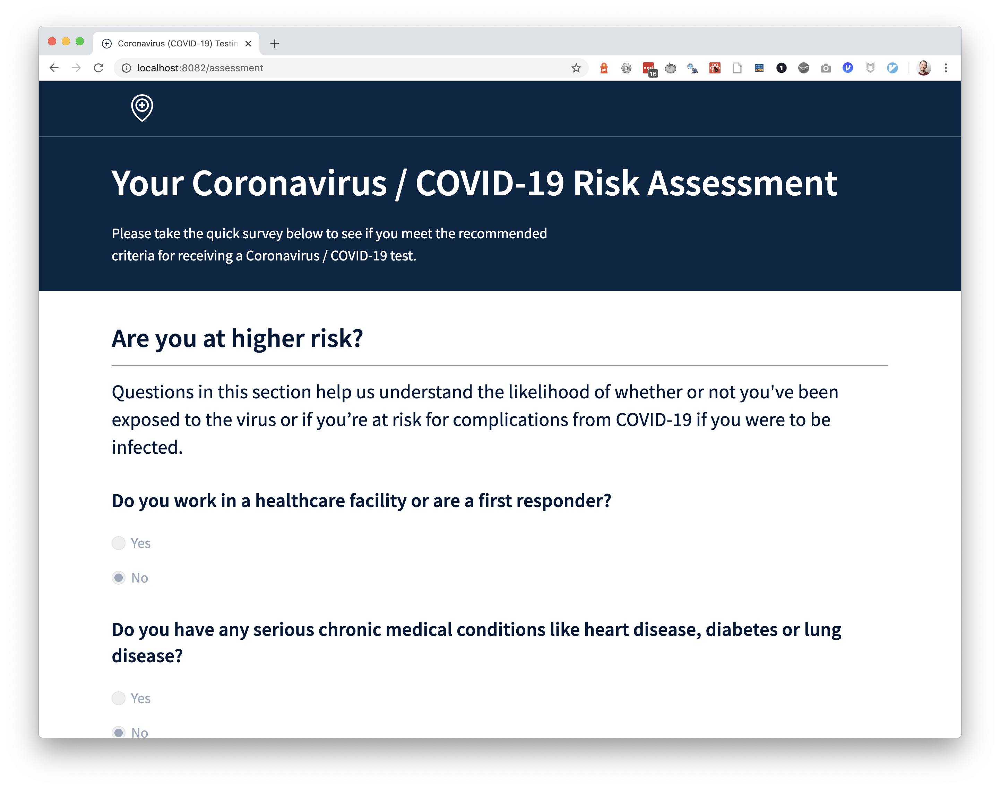
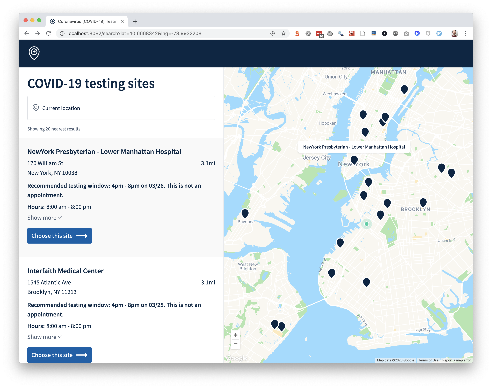
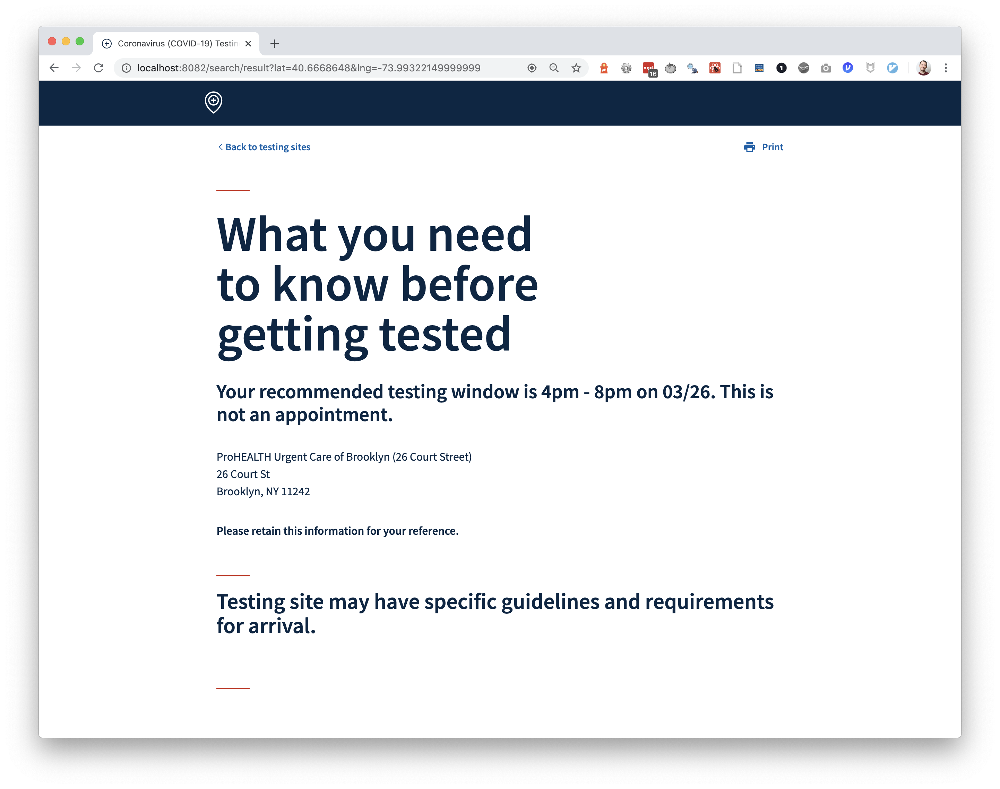

# COVID-19 Testing Site Finder with Risk Assessment

## What we built
A static site for users to take a COVID-19 risk assessment or search for testing site locations. 
Key components of the site include:
- A COVID-19 risk assessment
- A simple ETL for ingesting testing site data from a `.csv` file
- A user experience to search for testing sites by location (including a map view) and view testing site-specific detail 
- A recommendation engine to recommend testing window slots at each testing site
- A confirmation page to surface any critical information to prepare the user for testing

## Quickstart

## Getting Started

* Install [Node.js](https://nodejs.org/en/) >= 8.9.4 and npm >= 5.6.0
    * Check your node version with `node -v`
    * Check your npm version with `npm -v`
* Clone this repo and change directory to the cloned repo
* Add your Google Maps API key to a file named `.env` (see `example.env`) or pass in the command line as `GOOGLE_MAPS_API_KEY`.
    * Replace `REPLACE_WITH_GOOGLE_MAPS_API_KEY` with yours
* Install dependencies with `npm install`
* Run webpack dev with `npm run webpack-dev`
    * View the app at the local URL of [http://localhost:8082](http://localhost:8082)
    * Search for sites around New York City in order to locate fake site data for testing the application.
* Run webpack builds with `npm run build`

## Features

